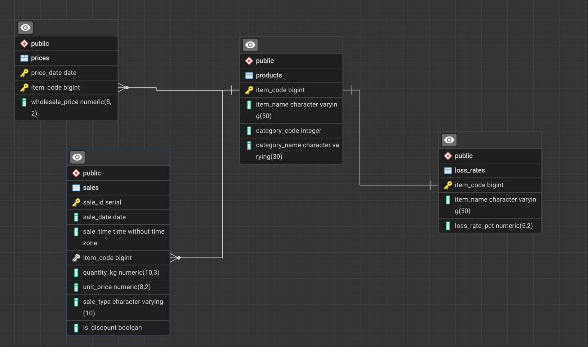

# Анализ продаж овощного оптового рынка
SQL-проект: анализ выручки, потерь и эффективности скидок 
на основе датасета продаж овощного магазина.

## Датасет
Данные о продажах овощного оптового магазина за период 2020.07.01 - 2023.06.30
- products (251 товар) — справочник товаров и категорий
- sales (878 503 записи) — транзакции продаж
- prices (55 982 записи) — закупочные цены по дням
- loss_rates (251 запись) — процент потерь при хранении

## Схема таблиц: 

## Инструменты
PostgreSQL, SQLTools (VS Code), Fedora Linux

## Вопросы и результаты

### 1. Финансовые показатели по категориям
[1_category_financials.sql](sql_project_files/1_category_financials.sql)

Самая прибыльная категория - Flower/Leaf Vegetables (маржа 39.87%), 
самая низкая маржа у Aquatic Tuberous Vegetables (30.81%).

### 2. Потери на порче/списании товаров
[2_product_loss_cost.sql](sql_project_files/2_product_loss_cost.sql)

Самая многочисленная категория по потерям из за списаний это:
    -Flower/Leaf Vegetables
Лучше всего будет уменьшить количество невостребованных цветов и листовых овощей для оптимизации трат

### 3. Выручка со скидкой и без скидки
[3_discount_efficiency.sql](sql_project_files/3_discount_efficiency.sql)

Суммарно, на товарах без скидки чистой выручки выходит больше в 2 раза.
Эффективность с покупки единицы товара выше, но и количество покупаемого товара ниже.

### 4. Часы и дни максимальной нагрузки и прибыли
[4_peak_hours_and_days.sql](sql_project_files/4_peak_hours_and_days.sql)

Можно отметить, что основные волны покупателей приходят утром в 10-11 часов и вечером в 17-18 часов. В среднем количество проданного товара в эти часы выше в 1.5 раза

Также среди дней недели основое количество покупок совершается в выходные дни (Суббота/Воскресенье) В эти дни количество покупок выше на 35%

### 5. Топ-3 товара по выручке в каждой категории
[5_top_products_per_category.sql](sql_project_files/5_top_products_per_category.sql)

В каждой из 6 категорий товар №1 заметно отрывается от №2 и №3 по выручке. Многие товары и №2 и №3 это по сути вариация одного товара. Тоесть спрос покупателей вокруг категории товаров, а не разбросан по ассортименту 

## Как запустить
1. Установить PostgreSQL (если ещё не установлен)
2. [Создание базы данных](sql_load/1_create_database.sql)
3. [Создание таблиц](sql_load/2_create_tables.sql)
4. [Импорт данных](sql_load/3_modify_tables.sql)